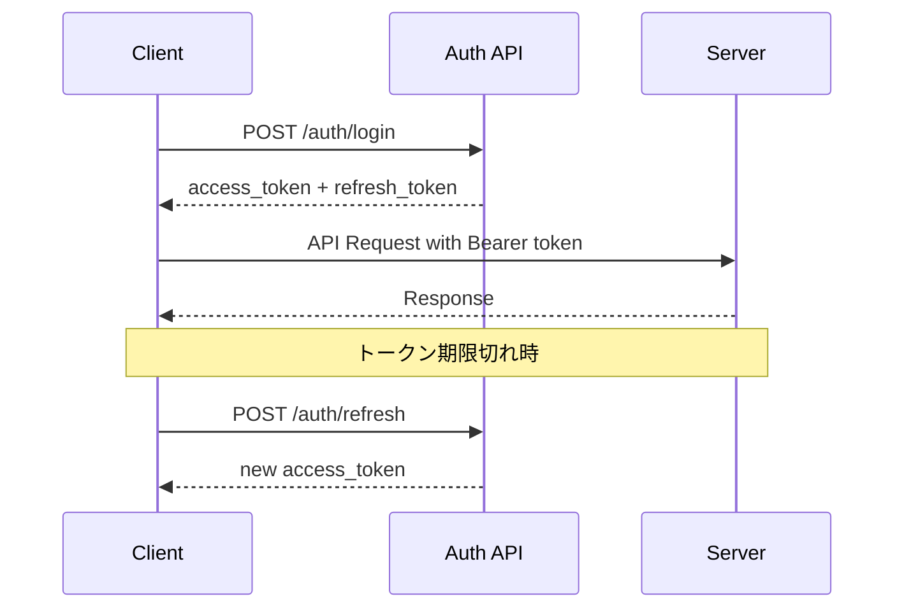

# Claude Code Client API仕様書

**バージョン**: 1.0  
**作成日**: 2025-06-25  
**API形式**: REST API + WebSocket  
**認証方式**: JWT Bearer Token  

---

## 目次

1. [API概要](#1-api概要)
2. [認証・認可](#2-認証認可)
3. [共通仕様](#3-共通仕様)
4. [エンドポイント詳細](#4-エンドポイント詳細)
5. [WebSocket仕様](#5-websocket仕様)
6. [エラーハンドリング](#6-エラーハンドリング)
7. [レート制限](#7-レート制限)
8. [テスト仕様](#8-テスト仕様)

---

## 1. API概要

### 1.1 ベースURL
```
# 開発環境
https://localhost:8000/api/v1

# 本番環境  
https://claude-code-client.example.com/api/v1
```

### 1.2 サポート形式
- **リクエスト**: `application/json`, `multipart/form-data`
- **レスポンス**: `application/json`
- **文字エンコーディング**: UTF-8

### 1.3 APIカテゴリ
```
├── 認証 (/auth)
├── ユーザー管理 (/users)  
├── セッション管理 (/sessions)
├── プロジェクト管理 (/projects)
├── Worktree管理 (/worktrees)
├── ファイル操作 (/files)
├── 通知管理 (/notifications)
├── コラボレーション (/collaboration)
└── システム (/system)
```

---

## 2. 認証・認可

### 2.1 認証フロー


### 2.2 認証API

#### POST /auth/login
```yaml
summary: ユーザーログイン
requestBody:
  required: true
  content:
    application/json:
      schema:
        type: object
        required: [username, password]
        properties:
          username:
            type: string
            minLength: 3
            maxLength: 50
            example: "developer"
          password:
            type: string
            minLength: 8
            example: "secure_password123"
          remember_me:
            type: boolean
            default: false
            description: "長期間ログイン保持"

responses:
  200:
    description: ログイン成功
    content:
      application/json:
        schema:
          type: object
          properties:
            access_token:
              type: string
              description: "JWTアクセストークン（1時間有効）"
            refresh_token:
              type: string
              description: "リフレッシュトークン（30日有効）"
            token_type:
              type: string
              example: "bearer"
            expires_in:
              type: integer
              example: 3600
              description: "アクセストークン有効期限（秒）"
            user:
              $ref: '#/components/schemas/User'
  401:
    $ref: '#/components/responses/Unauthorized'
  429:
    $ref: '#/components/responses/RateLimitExceeded'
```

#### POST /auth/refresh
```yaml
summary: アクセストークン更新
requestBody:
  required: true
  content:
    application/json:
      schema:
        type: object
        required: [refresh_token]
        properties:
          refresh_token:
            type: string
            description: "有効なリフレッシュトークン"

responses:
  200:
    description: トークン更新成功
    content:
      application/json:
        schema:
          type: object
          properties:
            access_token:
              type: string
            token_type:
              type: string
              example: "bearer"
            expires_in:
              type: integer
              example: 3600
  401:
    $ref: '#/components/responses/Unauthorized'
```

#### POST /auth/logout
```yaml
summary: ログアウト
security:
  - bearerAuth: []
requestBody:
  content:
    application/json:
      schema:
        type: object
        properties:
          logout_all_devices:
            type: boolean
            default: false
            description: "全デバイスからログアウト"

responses:
  200:
    description: ログアウト成功
    content:
      application/json:
        schema:
          type: object
          properties:
            message:
              type: string
              example: "ログアウトしました"
  401:
    $ref: '#/components/responses/Unauthorized'
```

---

## 3. 共通仕様

### 3.1 リクエストヘッダー
```http
Authorization: Bearer {access_token}
Content-Type: application/json
Accept: application/json
X-Request-ID: {uuid}  # オプション：リクエスト追跡用
User-Agent: Claude-Code-Client/1.0
```

### 3.2 レスポンス形式
```json
// 成功レスポンス
{
  "data": {
    // レスポンスデータ
  },
  "meta": {
    "timestamp": "2025-06-25T12:00:00Z",
    "request_id": "uuid",
    "version": "1.0"
  }
}

// エラーレスポンス
{
  "error": {
    "code": "VALIDATION_ERROR",
    "message": "リクエストが無効です",
    "details": [
      {
        "field": "username",
        "message": "ユーザー名は必須です"
      }
    ]
  },
  "meta": {
    "timestamp": "2025-06-25T12:00:00Z",
    "request_id": "uuid"
  }
}
```

### 3.3 ページネーション
```json
// リストAPIのレスポンス形式
{
  "data": {
    "items": [...],
    "pagination": {
      "page": 1,
      "per_page": 20,
      "total": 100,
      "total_pages": 5,
      "has_next": true,
      "has_prev": false
    }
  }
}
```

### 3.4 フィルタリング・ソート
```http
# クエリパラメータ例
GET /api/v1/sessions?status=running&sort=created_at:desc&page=1&per_page=20
```

---

## 4. エンドポイント詳細

### 4.1 ユーザー管理API

#### GET /users/me
```yaml
summary: 現在のユーザー情報取得
security:
  - bearerAuth: []
responses:
  200:
    description: ユーザー情報
    content:
      application/json:
        schema:
          $ref: '#/components/schemas/User'
```

#### PUT /users/me
```yaml
summary: ユーザー情報更新
security:
  - bearerAuth: []
requestBody:
  content:
    application/json:
      schema:
        type: object
        properties:
          email:
            type: string
            format: email
          preferences:
            type: object
            properties:
              language:
                type: string
                enum: [ja, en]
                default: ja
              theme:
                type: string
                enum: [light, dark, auto]
                default: auto
              terminal_font_size:
                type: integer
                minimum: 8
                maximum: 24
                default: 14
              notification_enabled:
                type: boolean
                default: true

responses:
  200:
    description: 更新成功
    content:
      application/json:
        schema:
          $ref: '#/components/schemas/User'
  400:
    $ref: '#/components/responses/BadRequest'
```

#### PUT /users/me/password
```yaml
summary: パスワード変更
security:
  - bearerAuth: []
requestBody:
  required: true
  content:
    application/json:
      schema:
        type: object
        required: [current_password, new_password]
        properties:
          current_password:
            type: string
          new_password:
            type: string
            minLength: 8
            pattern: '^(?=.*[a-z])(?=.*[A-Z])(?=.*\d)[a-zA-Z\d@$!%*?&]{8,}$'
            description: "英大文字・小文字・数字を含む8文字以上"

responses:
  200:
    description: パスワード変更成功
  400:
    $ref: '#/components/responses/BadRequest'
  401:
    $ref: '#/components/responses/Unauthorized'
```

### 4.2 セッション管理API

#### GET /sessions
```yaml
summary: セッション一覧取得
security:
  - bearerAuth: []
parameters:
  - name: status
    in: query
    schema:
      type: string
      enum: [running, stopped, error, starting, stopping]
  - name: project_id
    in: query
    schema:
      type: string
      format: uuid
  - name: sort
    in: query
    schema:
      type: string
      enum: [created_at:asc, created_at:desc, last_accessed:desc, name:asc]
      default: last_accessed:desc
  - name: page
    in: query
    schema:
      type: integer
      minimum: 1
      default: 1
  - name: per_page
    in: query
    schema:
      type: integer
      minimum: 1
      maximum: 100
      default: 20

responses:
  200:
    description: セッション一覧
    content:
      application/json:
        schema:
          type: object
          properties:
            data:
              type: object
              properties:
                items:
                  type: array
                  items:
                    $ref: '#/components/schemas/Session'
                pagination:
                  $ref: '#/components/schemas/Pagination'
```

#### POST /sessions
```yaml
summary: 新規セッション作成
security:
  - bearerAuth: []
requestBody:
  required: true
  content:
    application/json:
      schema:
        type: object
        required: [name]
        properties:
          name:
            type: string
            minLength: 1
            maxLength: 100
            example: "新規開発セッション"
          description:
            type: string
            maxLength: 500
            example: "Vue.js プロジェクトの開発"
          working_directory:
            type: string
            maxLength: 500
            example: "/workspace/my-project"
          project_id:
            type: string
            format: uuid
            description: "関連するプロジェクトID"
          worktree_id:
            type: string
            format: uuid
            description: "使用するWorktreeID"
          resource_limits:
            type: object
            properties:
              cpu_limit:
                type: number
                minimum: 0.1
                maximum: 4.0
                default: 1.0
              memory_limit_mb:
                type: integer
                minimum: 128
                maximum: 2048
                default: 512
              storage_limit_mb:
                type: integer
                minimum: 100
                maximum: 5120
                default: 1024

responses:
  201:
    description: セッション作成成功
    content:
      application/json:
        schema:
          $ref: '#/components/schemas/Session'
  400:
    $ref: '#/components/responses/BadRequest'
  403:
    description: リソース制限超過
    content:
      application/json:
        schema:
          $ref: '#/components/schemas/Error'
```

#### GET /sessions/{session_id}
```yaml
summary: セッション詳細取得
security:
  - bearerAuth: []
parameters:
  - name: session_id
    in: path
    required: true
    schema:
      type: string
      format: uuid

responses:
  200:
    description: セッション詳細
    content:
      application/json:
        schema:
          $ref: '#/components/schemas/SessionDetail'
  404:
    $ref: '#/components/responses/NotFound'
```

#### PUT /sessions/{session_id}
```yaml
summary: セッション情報更新
security:
  - bearerAuth: []
parameters:
  - name: session_id
    in: path
    required: true
    schema:
      type: string
      format: uuid
requestBody:
  content:
    application/json:
      schema:
        type: object
        properties:
          name:
            type: string
            maxLength: 100
          description:
            type: string
            maxLength: 500
          working_directory:
            type: string
            maxLength: 500

responses:
  200:
    description: 更新成功
    content:
      application/json:
        schema:
          $ref: '#/components/schemas/Session'
```

#### POST /sessions/{session_id}/start
```yaml
summary: セッション開始
security:
  - bearerAuth: []
parameters:
  - name: session_id
    in: path
    required: true
    schema:
      type: string
      format: uuid

responses:
  200:
    description: セッション開始成功
    content:
      application/json:
        schema:
          type: object
          properties:
            session_id:
              type: string
              format: uuid
            status:
              type: string
              example: "starting"
            websocket_url:
              type: string
              example: "wss://localhost:8000/ws/session/{session_id}"
            container_info:
              type: object
              properties:
                container_id:
                  type: string
                port_mapping:
                  type: object
  409:
    description: セッション既に実行中
```

#### POST /sessions/{session_id}/stop
```yaml
summary: セッション停止
security:
  - bearerAuth: []
parameters:
  - name: session_id
    in: path
    required: true
    schema:
      type: string
      format: uuid
requestBody:
  content:
    application/json:
      schema:
        type: object
        properties:
          force:
            type: boolean
            default: false
            description: "強制停止フラグ"

responses:
  200:
    description: セッション停止成功
```

#### DELETE /sessions/{session_id}
```yaml
summary: セッション削除
security:
  - bearerAuth: []
parameters:
  - name: session_id
    in: path
    required: true
    schema:
      type: string
      format: uuid
requestBody:
  content:
    application/json:
      schema:
        type: object
        properties:
          delete_data:
            type: boolean
            default: false
            description: "セッションデータも削除するか"

responses:
  204:
    description: 削除成功
  409:
    description: セッション実行中のため削除不可
```

### 4.3 プロジェクト管理API

#### GET /projects
```yaml
summary: プロジェクト一覧取得
security:
  - bearerAuth: []
parameters:
  - name: owner
    in: query
    description: "所有者フィルタ（me, all）"
    schema:
      type: string
      enum: [me, all]
      default: me
  - name: is_public
    in: query
    schema:
      type: boolean
  - name: tech_stack
    in: query
    description: "技術スタックでフィルタ"
    schema:
      type: string
      example: "python,fastapi"
  - name: search
    in: query
    description: "プロジェクト名・説明での検索"
    schema:
      type: string

responses:
  200:
    description: プロジェクト一覧
    content:
      application/json:
        schema:
          type: object
          properties:
            data:
              type: object
              properties:
                items:
                  type: array
                  items:
                    $ref: '#/components/schemas/Project'
```

#### POST /projects
```yaml
summary: 新規プロジェクト作成
security:
  - bearerAuth: []
requestBody:
  required: true
  content:
    application/json:
      schema:
        type: object
        required: [name]
        properties:
          name:
            type: string
            minLength: 1
            maxLength: 100
          description:
            type: string
            maxLength: 1000
          project_type:
            type: string
            enum: [web, api, cli, mobile, data, general]
            default: general
          repository_url:
            type: string
            format: uri
            example: "https://github.com/user/repo.git"
          local_path:
            type: string
            maxLength: 500
          tech_stack:
            type: array
            items:
              type: string
            example: ["python", "fastapi", "postgresql"]
          is_public:
            type: boolean
            default: false

responses:
  201:
    description: プロジェクト作成成功
    content:
      application/json:
        schema:
          $ref: '#/components/schemas/Project'
```

### 4.4 Worktree管理API

#### GET /worktrees
```yaml
summary: Worktree一覧取得
security:
  - bearerAuth: []
parameters:
  - name: repository_path
    in: query
    schema:
      type: string
  - name: status
    in: query
    schema:
      type: string
      enum: [active, inactive, error]
  - name: project_id
    in: query
    schema:
      type: string
      format: uuid

responses:
  200:
    description: Worktree一覧
    content:
      application/json:
        schema:
          type: object
          properties:
            data:
              type: object
              properties:
                items:
                  type: array
                  items:
                    $ref: '#/components/schemas/Worktree'
```

#### POST /worktrees
```yaml
summary: 新規Worktree作成
security:
  - bearerAuth: []
requestBody:
  required: true
  content:
    application/json:
      schema:
        type: object
        required: [repository_path, branch_name, worktree_name]
        properties:
          repository_path:
            type: string
            description: "メインリポジトリのパス"
            example: "/workspace/main-repo"
          branch_name:
            type: string
            description: "作成するブランチ名"
            example: "feature/new-feature"
          worktree_name:
            type: string
            description: "Worktree名"
            example: "feature-workspace"
          base_branch:
            type: string
            description: "ベースブランチ（省略時はmain）"
            default: "main"
          project_id:
            type: string
            format: uuid
          session_id:
            type: string
            format: uuid
            description: "関連付けるセッション"

responses:
  201:
    description: Worktree作成成功
    content:
      application/json:
        schema:
          $ref: '#/components/schemas/Worktree'
  400:
    description: 作成失敗（ブランチ既存等）
  409:
    description: Worktreeパス既存
```

#### GET /worktrees/{worktree_id}/diff
```yaml
summary: Worktree差分取得
security:
  - bearerAuth: []
parameters:
  - name: worktree_id
    in: path
    required: true
    schema:
      type: string
      format: uuid
  - name: target_branch
    in: query
    description: "比較対象ブランチ"
    schema:
      type: string
      default: "main"
  - name: file_path
    in: query
    description: "特定ファイルの差分のみ取得"
    schema:
      type: string

responses:
  200:
    description: 差分情報
    content:
      application/json:
        schema:
          type: object
          properties:
            diff_summary:
              type: object
              properties:
                files_changed:
                  type: integer
                lines_added:
                  type: integer
                lines_deleted:
                  type: integer
            file_diffs:
              type: array
              items:
                type: object
                properties:
                  file_path:
                    type: string
                  change_type:
                    type: string
                    enum: [added, modified, deleted, renamed]
                  diff_content:
                    type: string
                    description: "unified diff形式"
                  language:
                    type: string
                  binary:
                    type: boolean
```

#### POST /worktrees/{worktree_id}/sync
```yaml
summary: Worktree同期実行
security:
  - bearerAuth: []
parameters:
  - name: worktree_id
    in: path
    required: true
    schema:
      type: string
      format: uuid
requestBody:
  required: true
  content:
    application/json:
      schema:
        type: object
        required: [sync_type]
        properties:
          sync_type:
            type: string
            enum: [merge, cherry-pick, rebase, pull, push]
          target_worktree_id:
            type: string
            format: uuid
            description: "同期先Worktree（merge等の場合）"
          target_branch:
            type: string
            description: "同期先ブランチ（pull/push等の場合）"
          files:
            type: array
            items:
              type: string
            description: "特定ファイルのみ同期"
          commit_message:
            type: string
            description: "コミットメッセージ（merge等の場合）"
          auto_resolve_conflicts:
            type: boolean
            default: false
            description: "自動競合解決"

responses:
  200:
    description: 同期成功
    content:
      application/json:
        schema:
          type: object
          properties:
            sync_history_id:
              type: integer
            status:
              type: string
              enum: [success, partial, failed]
            result_summary:
              type: object
              properties:
                files_changed:
                  type: integer
                conflicts_count:
                  type: integer
                commit_hash:
                  type: string
            conflicts:
              type: array
              items:
                type: object
                properties:
                  file_path:
                    type: string
                  conflict_markers:
                    type: array
                    items:
                      type: string
  409:
    description: 競合発生・手動解決必要
```

### 4.5 ファイル操作API

#### GET /files
```yaml
summary: ファイル・ディレクトリ一覧取得
security:
  - bearerAuth: []
parameters:
  - name: session_id
    in: query
    required: true
    schema:
      type: string
      format: uuid
  - name: path
    in: query
    description: "取得するディレクトリパス"
    schema:
      type: string
      default: "."
  - name: include_hidden
    in: query
    schema:
      type: boolean
      default: false

responses:
  200:
    description: ファイル一覧
    content:
      application/json:
        schema:
          type: object
          properties:
            current_path:
              type: string
            items:
              type: array
              items:
                type: object
                properties:
                  name:
                    type: string
                  path:
                    type: string
                  type:
                    type: string
                    enum: [file, directory, symlink]
                  size:
                    type: integer
                  modified_at:
                    type: string
                    format: date-time
                  permissions:
                    type: string
                    example: "rw-r--r--"
                  is_binary:
                    type: boolean
                  language:
                    type: string
```

#### GET /files/content
```yaml
summary: ファイル内容取得
security:
  - bearerAuth: []
parameters:
  - name: session_id
    in: query
    required: true
    schema:
      type: string
      format: uuid
  - name: file_path
    in: query
    required: true
    schema:
      type: string
  - name: encoding
    in: query
    schema:
      type: string
      enum: [utf-8, shift-jis, euc-jp]
      default: utf-8

responses:
  200:
    description: ファイル内容
    content:
      application/json:
        schema:
          type: object
          properties:
            content:
              type: string
            encoding:
              type: string
            file_info:
              type: object
              properties:
                size:
                  type: integer
                modified_at:
                  type: string
                  format: date-time
                language:
                  type: string
                line_count:
                  type: integer
      text/plain:
        schema:
          type: string
  400:
    description: バイナリファイル・サイズ超過等
```

#### PUT /files/content
```yaml
summary: ファイル内容更新
security:
  - bearerAuth: []
requestBody:
  required: true
  content:
    application/json:
      schema:
        type: object
        required: [session_id, file_path, content]
        properties:
          session_id:
            type: string
            format: uuid
          file_path:
            type: string
          content:
            type: string
          encoding:
            type: string
            default: utf-8
          create_directories:
            type: boolean
            default: false
            description: "中間ディレクトリを自動作成"

responses:
  200:
    description: 更新成功
    content:
      application/json:
        schema:
          type: object
          properties:
            file_path:
              type: string
            size:
              type: integer
            modified_at:
              type: string
              format: date-time
  400:
    $ref: '#/components/responses/BadRequest'
  403:
    description: 書き込み権限なし
```

#### POST /files/upload
```yaml
summary: ファイルアップロード
security:
  - bearerAuth: []
requestBody:
  required: true
  content:
    multipart/form-data:
      schema:
        type: object
        required: [session_id, file, target_path]
        properties:
          session_id:
            type: string
            format: uuid
          file:
            type: string
            format: binary
            description: "アップロードファイル"
          target_path:
            type: string
            description: "保存先ディレクトリパス"
          overwrite:
            type: boolean
            default: false

responses:
  201:
    description: アップロード成功
    content:
      application/json:
        schema:
          type: object
          properties:
            file_path:
              type: string
            size:
              type: integer
            uploaded_at:
              type: string
              format: date-time
  413:
    description: ファイルサイズ超過
```

### 4.6 通知管理API

#### GET /notifications/settings
```yaml
summary: 通知設定取得
security:
  - bearerAuth: []

responses:
  200:
    description: 通知設定一覧
    content:
      application/json:
        schema:
          type: object
          properties:
            web_push:
              type: object
              properties:
                enabled:
                  type: boolean
                subscription:
                  type: object
                  description: "PushSubscriptionオブジェクト"
            webhooks:
              type: array
              items:
                type: object
                properties:
                  service_type:
                    type: string
                    enum: [line, slack, discord]
                  enabled:
                    type: boolean
                  webhook_url:
                    type: string
                  notification_types:
                    type: array
                    items:
                      type: string
```

#### PUT /notifications/settings
```yaml
summary: 通知設定更新
security:
  - bearerAuth: []
requestBody:
  required: true
  content:
    application/json:
      schema:
        type: object
        properties:
          web_push:
            type: object
            properties:
              enabled:
                type: boolean
              subscription:
                type: object
                description: "PushSubscriptionオブジェクト"
          webhook_settings:
            type: array
            items:
              type: object
              properties:
                service_type:
                  type: string
                  enum: [line, slack, discord]
                enabled:
                  type: boolean
                webhook_url:
                  type: string
                notification_types:
                  type: array
                  items:
                    type: string
                    enum: [claude_request, task_completed, error_occurred]

responses:
  200:
    description: 設定更新成功
```

#### POST /notifications/test
```yaml
summary: テスト通知送信
security:
  - bearerAuth: []
requestBody:
  required: true
  content:
    application/json:
      schema:
        type: object
        required: [service_type]
        properties:
          service_type:
            type: string
            enum: [web_push, line, slack, discord]
          message:
            type: string
            default: "テスト通知です"

responses:
  200:
    description: テスト通知送信成功
  400:
    description: 設定不備・送信失敗
```

---

## 5. WebSocket仕様

### 5.1 接続エンドポイント
```
wss://localhost:8000/ws/session/{session_id}?token={access_token}
```

### 5.2 認証
```javascript
// 接続時認証
const ws = new WebSocket(`wss://localhost:8000/ws/session/${sessionId}?token=${accessToken}`);

// またはメッセージでの認証
ws.send(JSON.stringify({
  type: 'auth',
  token: accessToken
}));
```

### 5.3 メッセージ形式

#### クライアント→サーバー
```json
// ターミナル入力
{
  "type": "terminal_input",
  "data": "ls -la\n",
  "timestamp": "2025-06-25T12:00:00Z"
}

// Claude メッセージ送信
{
  "type": "claude_message",
  "message": "このコードを最適化してください",
  "context": {
    "files": ["/workspace/app.py", "/workspace/config.py"],
    "working_directory": "/workspace",
    "current_task": "パフォーマンス改善"
  },
  "timestamp": "2025-06-25T12:00:00Z"
}

// ファイル変更通知
{
  "type": "file_changed",
  "file_path": "/workspace/app.py",
  "change_type": "modified",
  "timestamp": "2025-06-25T12:00:00Z"
}

// セッション状態変更
{
  "type": "session_command",
  "command": "pause",  // pause, resume, restart
  "timestamp": "2025-06-25T12:00:00Z"
}
```

#### サーバー→クライアント
```json
// ターミナル出力
{
  "type": "terminal_output",
  "data": "total 4\ndrwxr-xr-x 2 user user 4096 Jun 25 12:00 .\n",
  "timestamp": "2025-06-25T12:00:00Z"
}

// Claude レスポンス
{
  "type": "claude_response",
  "response": "コードを分析しました。以下の改善点があります...",
  "response_type": "text",  // text, code, diff
  "token_usage": {
    "input_tokens": 150,
    "output_tokens": 300
  },
  "timestamp": "2025-06-25T12:00:00Z"
}

// システム通知
{
  "type": "notification",
  "level": "info",  // info, warning, error
  "title": "セッション開始",
  "message": "開発環境が準備できました",
  "action_required": false,
  "timestamp": "2025-06-25T12:00:00Z"
}

// セッション状態更新
{
  "type": "session_status",
  "status": "running",  // starting, running, paused, stopping, stopped, error
  "container_info": {
    "container_id": "abc123",
    "port_mapping": {
      "3000": "30001",
      "8000": "30002"
    }
  },
  "timestamp": "2025-06-25T12:00:00Z"
}

// コラボレーション通知
{
  "type": "collaboration",
  "event": "user_joined",  // user_joined, user_left, cursor_moved, edit_made
  "user": {
    "id": 123,
    "username": "collaborator",
    "cursor_position": {
      "file_path": "/workspace/app.py",
      "line": 25,
      "column": 10
    }
  },
  "timestamp": "2025-06-25T12:00:00Z"
}
```

### 5.4 接続状態管理
```json
// ハートビート（30秒間隔）
{
  "type": "ping",
  "timestamp": "2025-06-25T12:00:00Z"
}

// レスポンス
{
  "type": "pong",
  "timestamp": "2025-06-25T12:00:00Z"
}

// 接続終了通知
{
  "type": "close",
  "reason": "session_ended",  // session_ended, user_logout, server_shutdown, error
  "message": "セッションが終了しました",
  "timestamp": "2025-06-25T12:00:00Z"
}
```

---

## 6. エラーハンドリング

### 6.1 HTTPステータスコード
```
200 OK                - 成功
201 Created           - 作成成功  
204 No Content        - 成功（レスポンスボディなし）
400 Bad Request       - リクエストエラー
401 Unauthorized      - 認証エラー
403 Forbidden         - 権限エラー
404 Not Found         - リソース未発見
409 Conflict          - 競合エラー
413 Payload Too Large - ファイルサイズ超過
422 Unprocessable Entity - バリデーションエラー
429 Too Many Requests - レート制限
500 Internal Server Error - サーバーエラー
502 Bad Gateway       - 外部API エラー
503 Service Unavailable - サービス停止中
```

### 6.2 エラーレスポンス詳細
```json
// バリデーションエラー
{
  "error": {
    "code": "VALIDATION_ERROR",
    "message": "入力値が無効です",
    "details": [
      {
        "field": "username",
        "code": "REQUIRED",
        "message": "ユーザー名は必須です"
      },
      {
        "field": "password",
        "code": "MIN_LENGTH",
        "message": "パスワードは8文字以上である必要があります",
        "params": {
          "min_length": 8,
          "current_length": 5
        }
      }
    ]
  },
  "meta": {
    "timestamp": "2025-06-25T12:00:00Z",
    "request_id": "req_123456"
  }
}

// リソース制限エラー
{
  "error": {
    "code": "RESOURCE_LIMIT_EXCEEDED",
    "message": "セッション数の上限に達しています",
    "details": {
      "current_sessions": 10,
      "max_sessions": 10,
      "resource_type": "sessions"
    }
  }
}

// 外部API エラー
{
  "error": {
    "code": "EXTERNAL_API_ERROR",
    "message": "Claude API でエラーが発生しました",
    "details": {
      "service": "claude_api",
      "error_code": "rate_limit_exceeded",
      "retry_after": 60
    }
  }
}
```

### 6.3 エラーコード一覧
```
認証・認可エラー:
- AUTHENTICATION_FAILED    - 認証失敗
- TOKEN_EXPIRED           - トークン期限切れ
- TOKEN_INVALID           - 無効なトークン
- INSUFFICIENT_PERMISSIONS - 権限不足

バリデーションエラー:
- VALIDATION_ERROR        - 入力値検証エラー
- REQUIRED_FIELD         - 必須フィールド未入力
- INVALID_FORMAT         - 形式不正
- VALUE_OUT_OF_RANGE     - 値範囲外

リソースエラー:
- RESOURCE_NOT_FOUND     - リソース未発見
- RESOURCE_ALREADY_EXISTS - リソース重複
- RESOURCE_LIMIT_EXCEEDED - リソース制限超過
- RESOURCE_LOCKED        - リソースロック中

システムエラー:
- INTERNAL_SERVER_ERROR  - サーバー内部エラー
- DATABASE_ERROR         - データベースエラー
- EXTERNAL_API_ERROR     - 外部API エラー
- SERVICE_UNAVAILABLE    - サービス利用不可
```

---

## 7. レート制限

### 7.1 制限内容
```
API種別別制限:
- 認証API: 10リクエスト/分/IP
- 一般API: 100リクエスト/分/ユーザー
- ファイルアップロード: 10リクエスト/分/ユーザー
- Claude API連携: 50リクエスト/分/ユーザー（Claude API制限に準拠）

WebSocket:
- 接続数: 10接続/ユーザー
- メッセージ: 100メッセージ/分/接続
```

### 7.2 レート制限レスポンス
```http
HTTP/1.1 429 Too Many Requests
X-RateLimit-Limit: 100
X-RateLimit-Remaining: 0
X-RateLimit-Reset: 1640995200
Retry-After: 60

{
  "error": {
    "code": "RATE_LIMIT_EXCEEDED",
    "message": "リクエスト制限に達しました",
    "details": {
      "limit": 100,
      "reset_time": "2025-06-25T12:01:00Z"
    }
  }
}
```

---

## 8. テスト仕様

### 8.1 APIテスト環境
```bash
# テスト環境URL
BASE_URL=https://test.claude-code-client.example.com/api/v1

# テストユーザー
TEST_USER=test_developer
TEST_PASSWORD=test_password123
```

### 8.2 認証テストケース
```yaml
test_cases:
  - name: "正常ログイン"
    method: POST
    endpoint: /auth/login
    body:
      username: test_developer
      password: test_password123
    expected_status: 200
    expected_response:
      access_token: exists
      user.username: test_developer

  - name: "無効パスワード"
    method: POST
    endpoint: /auth/login
    body:
      username: test_developer
      password: wrong_password
    expected_status: 401
    expected_error_code: AUTHENTICATION_FAILED
```

### 8.3 負荷テスト仕様
```yaml
load_test:
  scenarios:
    - name: "通常API負荷"
      users: 50
      duration: 60s
      endpoints:
        - GET /sessions (weight: 40%)
        - POST /sessions (weight: 20%)  
        - GET /files (weight: 30%)
        - PUT /files/content (weight: 10%)
    
    - name: "WebSocket負荷"
      connections: 100
      duration: 60s
      message_rate: 10/sec/connection
```

---

## 付録

### A. OpenAPI スキーマ定義
```yaml
components:
  schemas:
    User:
      type: object
      properties:
        id:
          type: integer
        username:
          type: string
        email:
          type: string
          format: email
        is_active:
          type: boolean
        preferences:
          type: object
        created_at:
          type: string
          format: date-time

    Session:
      type: object
      properties:
        id:
          type: integer
        session_id:
          type: string
          format: uuid
        name:
          type: string
        description:
          type: string
        status:
          type: string
          enum: [running, stopped, error, starting, stopping]
        working_directory:
          type: string
        user_id:
          type: integer
        project_id:
          type: integer
        created_at:
          type: string
          format: date-time
        last_accessed:
          type: string
          format: date-time

  securitySchemes:
    bearerAuth:
      type: http
      scheme: bearer
      bearerFormat: JWT

  responses:
    BadRequest:
      description: リクエストエラー
      content:
        application/json:
          schema:
            $ref: '#/components/schemas/Error'
    
    Unauthorized:
      description: 認証エラー
      content:
        application/json:
          schema:
            $ref: '#/components/schemas/Error'
```

### B. SDK サンプルコード
```python
# Python SDK使用例
import claude_code_client

client = claude_code_client.Client(
    base_url="https://localhost:8000/api/v1",
    access_token="your_access_token"
)

# セッション作成
session = client.sessions.create(
    name="開発セッション",
    project_id="project-uuid"
)

# セッション開始
session.start()

# WebSocket接続
ws = client.websocket.connect(session.session_id)

# Claude メッセージ送信
ws.send_claude_message("このコードをレビューしてください")
```

---

**作成者**: Claude Code チーム  
**レビュー**: APIエンジニア  
**承認日**: 2025-06-25  
**API バージョン**: 1.0