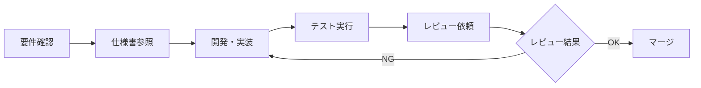

# Claude Code Client 開発ドキュメント

**プロジェクト**: Claude Code Client  
**バージョン**: 2.0  
**最終更新**: 2025-06-25  

---

## 📋 ドキュメント概要

このディレクトリには、Claude Code Client プロジェクトの開発に必要な全ての技術仕様書・設計ドキュメントが含まれています。

## 📚 ドキュメント構成

### 📖 主要仕様書

| ドキュメント | 説明 | 対象読者 |
|-------------|------|----------|
| [**統合要件定義書**](./統合要件定義書.md) | プロジェクト全体の要件・仕様統合版 | 全開発者・PM |
| [**データベース設計仕様書**](./データベース設計仕様書.md) | PostgreSQL データベース詳細設計 | バックエンド開発者・DBA |
| [**API仕様書**](./API仕様書.md) | REST API・WebSocket 完全仕様 | フロントエンド・バックエンド開発者 |
| [**セキュリティ仕様書**](./セキュリティ仕様書.md) | セキュリティ要件・実装詳細 | セキュリティエンジニア・全開発者 |

### 🎨 UI/UX設計書

| ドキュメント | 説明 | 対象読者 |
|-------------|------|----------|
| [**UI設計書**](./ui-design.md) | ユーザーインターフェース設計 | フロントエンド開発者・デザイナー |
| [**管理UI設計書**](./admin-ui-design.md) | 管理者インターフェース設計 | フロントエンド開発者・管理者 |

### 📋 参考ドキュメント

| ドキュメント | 説明 | 対象読者 |
|-------------|------|----------|
| [**要件定義書**](./要件定義書.md) | 原初要件定義（参考用） | 全開発者 |

## 🚀 プロジェクト開始ガイド

### 1. 必読ドキュメント順序

開発に参加する際は、以下の順序でドキュメントを読むことを推奨します：

```
1. 統合要件定義書 (全体把握)
   ↓
2. 担当領域の専門仕様書
   ├─ バックエンド → データベース設計仕様書 + API仕様書
   ├─ フロントエンド → API仕様書 + UI設計書
   ├─ インフラ → セキュリティ仕様書 + 統合要件定義書
   └─ QA → 全仕様書
   ↓
3. セキュリティ仕様書 (全員必読)
```

### 2. 開発環境セットアップ

```bash
# リポジトリクローン
git clone https://github.com/your-org/claude-code-client.git
cd claude-code-client

# 開発環境構築
docker-compose -f docker-compose.dev.yml up -d

# データベース初期化
cd backend
python init_db.py

# フロントエンド依存関係インストール
cd ../frontend
npm install

# 開発サーバー起動
npm run dev
```

### 3. 開発フロー



## 📊 プロジェクト進捗

### 現在の実装状況

| 機能カテゴリ | 進捗率 | 状態 | 備考 |
|-------------|--------|------|------|
| 認証・ユーザー管理 | 90% | ✅ 完了 | JWT認証実装済み |
| セッション管理 | 85% | 🔄 実装中 | 基本機能完了、WebSocket調整中 |
| ターミナル機能 | 80% | 🔄 実装中 | xterm.js統合完了 |
| ファイル管理 | 75% | 🔄 実装中 | CRUD操作実装済み |
| プロジェクト管理 | 70% | 🔄 実装中 | 基本機能実装済み |
| 通知システム | 60% | 🔄 実装中 | Web Push準備中 |
| コラボレーション | 55% | 🔄 実装中 | 基本構造完了 |
| Git Worktree管理 | 10% | ❌ 未実装 | 設計完了、実装待ち |
| Claude Code統合 | 40% | 🔄 実装中 | 基本統合完了、詳細調整中 |

### 次期実装予定

#### フェーズ4: 残存機能実装 (予定: 4週間)
- [ ] Git Worktree管理機能完全実装
- [ ] Webhook連携（LINE/Slack/Discord）
- [ ] OAuth認証対応  
- [ ] モバイル対応・PWA化
- [ ] パフォーマンス最適化

## 🔧 技術スタック

### バックエンド
```
言語: Python 3.11+
フレームワーク: FastAPI 0.104+
データベース: PostgreSQL 13+
ORM: SQLAlchemy 2.0+
認証: JWT + bcrypt
WebSocket: FastAPI内蔵
```

### フロントエンド
```
言語: TypeScript 5.0+
フレームワーク: Vue.js 3.3+
状態管理: Pinia
UI: Tailwind CSS 3.3+
ターミナル: xterm.js
バンドラ: Vite
```

### インフラ・運用
```
コンテナ: Docker + Docker Compose
リバースプロキシ: Nginx
CI/CD: GitHub Actions
監視: 構造化ログ + カスタムメトリクス
セキュリティ: 多層防御 + 暗号化
```

## 📐 アーキテクチャ概要

```
┌─────────────────┐    ┌──────────────┐    ┌─────────────────┐
│   ブラウザ      │    │    Nginx     │    │   FastAPI       │
│   (Vue.js)     │◄──►│ (リバース    │◄──►│   (REST API)    │
│                │    │  プロキシ)    │    │   (WebSocket)   │
└─────────────────┘    └──────────────┘    └─────────────────┘
                                                    │
                                           ┌─────────────────┐
                                           │  PostgreSQL     │
                                           │  (データベース)  │
                                           └─────────────────┘
                                                    │
┌─────────────────┐    ┌──────────────┐    ┌─────────────────┐
│  Docker         │    │   Claude     │    │   外部サービス   │
│  (ユーザー      │◄──►│   API        │    │   (LINE/Slack   │
│   セッション)   │    │              │    │    /Discord)    │
└─────────────────┘    └──────────────┘    └─────────────────┘
```

## 🔐 セキュリティ重要事項

### 必須セキュリティ原則
1. **最小権限の原則**: 必要最小限の権限のみ付与
2. **入力検証**: 全ての入力値を検証・サニタイズ
3. **出力エンコーディング**: XSS防止のため出力をエスケープ
4. **認証・認可**: 全APIエンドポイントで実装
5. **データ暗号化**: 機密データは保存時・転送時ともに暗号化

### セキュリティチェックポイント
- [ ] パスワードハッシュ化 (bcrypt)
- [ ] JWT トークン適切な実装
- [ ] HTTPS/WSS 強制
- [ ] CORS 適切な設定
- [ ] CSRFトークン実装
- [ ] レート制限実装
- [ ] 入力値検証実装
- [ ] 監査ログ実装

## 🧪 テスト戦略

### テスト種別・カバレッジ目標
```
単体テスト: 80%以上 (pytest)
統合テスト: 主要APIエンドポイント全て
E2Eテスト: 主要ユーザーフロー全て (Playwright)
セキュリティテスト: OWASP Top 10対応
パフォーマンステスト: 100ユーザー同時接続
```

### テスト実行方法
```bash
# バックエンドテスト
cd backend
pytest --cov=app tests/ --cov-report=html

# フロントエンドテスト  
cd frontend
npm run test:unit
npm run test:e2e

# セキュリティテスト
docker run -v $(pwd):/zap/wrk/:rw -t owasp/zap2docker-stable zap-baseline.py -t https://localhost:8000
```

## 📊 開発メトリクス・KPI

### 品質メトリクス
- **コードカバレッジ**: 目標 80%以上
- **バグ密度**: 目標 < 0.1 bugs/KLOC
- **技術的負債**: SonarQube評価 A以上
- **セキュリティ脆弱性**: 高・重要レベル 0件

### パフォーマンスメトリクス  
- **API レスポンス時間**: 平均 < 200ms
- **ページ読み込み時間**: 初回 < 2秒、2回目以降 < 1秒
- **WebSocket遅延**: < 100ms
- **同時接続数**: 100ユーザー対応

## 🤝 開発参加ガイド

### 1. コーディング規約
- **Python**: PEP8 準拠、型ヒント必須
- **TypeScript**: ESLint + Prettier、strict mode
- **コミットメッセージ**: Conventional Commits形式
- **ブランチ戦略**: Git Flow

### 2. プルリクエスト要件
- [ ] 関連するテストコード作成・更新
- [ ] ドキュメント更新（該当する場合）
- [ ] セキュリティチェック通過
- [ ] コードレビュー2名以上の承認
- [ ] CI/CDパイプライン全て通過

### 3. レビューチェックリスト
- [ ] 機能要件を満たしているか
- [ ] セキュリティ要件を満たしているか
- [ ] パフォーマンスに問題はないか
- [ ] テストカバレッジは十分か
- [ ] ドキュメントは更新されているか

## 🆘 サポート・連絡先

### 開発チーム連絡先
- **プロジェクトマネージャー**: pm@claude-code-client.com
- **テックリード**: tech-lead@claude-code-client.com  
- **セキュリティ担当**: security@claude-code-client.com
- **インフラ担当**: infra@claude-code-client.com

### トラブルシューティング
1. **開発環境問題**: [トラブルシューティングガイド](./troubleshooting.md)
2. **API問題**: [API仕様書](./API仕様書.md) の「エラーハンドリング」セクション
3. **セキュリティ問題**: [セキュリティ仕様書](./セキュリティ仕様書.md) の「インシデント対応」セクション

### 外部リソース
- **Claude Code公式ドキュメント**: https://docs.anthropic.com/claude-code
- **FastAPI公式ドキュメント**: https://fastapi.tiangolo.com/
- **Vue.js公式ドキュメント**: https://vuejs.org/guide/

---

## 📝 変更履歴

| バージョン | 日付 | 変更内容 | 担当者 |
|-----------|------|----------|--------|
| 2.0 | 2025-06-25 | 技術仕様詳細化・統合ドキュメント完成 | 開発チーム |
| 1.1 | 2025-06-20 | フェーズ3機能実装完了・ドキュメント更新 | 開発チーム |
| 1.0 | 2025-06-01 | 初期要件定義・基本設計完了 | 開発チーム |

---

**最終更新者**: Claude Code 開発チーム  
**承認者**: プロジェクトマネージャー  
**次回レビュー予定**: 2025-07-25